# UGC App Redesign – UI/UX Case Study

## 📌 Overview

This project is a conceptual redesign of a User-Generated Content (UGC) platform focused on improving usability, visual hierarchy, and overall user engagement. The goal was to transform a cluttered and confusing interface into a clean, modern, and intuitive experience.

---

## ❌ Problem

The existing UGC platform had several usability and design issues:

- Cluttered interface with poor spacing
- Weak visual hierarchy
- Difficult content discovery
- Unclear call-to-action buttons
- Inconsistent typography and color usage
- Poor mobile responsiveness

These issues negatively affected user engagement and made navigation confusing.

---

## 🎯 Objective

The main objective of this redesign was to:

- Improve content visibility
- Create a clear and consistent layout structure
- Enhance user navigation
- Increase engagement through better UI clarity
- Build a responsive design for both desktop and mobile

---

## 💡 Solution

To address the problems, I implemented the following design improvements:

- Introduced a clean grid-based layout
- Improved typography hierarchy for better readability
- Designed clear and consistent CTA buttons
- Simplified navigation structure
- Created visually balanced content cards
- Improved spacing and alignment
- Designed responsive layouts for mobile devices

The redesign focuses on clarity, accessibility, and user-centered design principles.

---

## 🧠 Design Process

1. UX audit of the existing interface  
2. Identified pain points and usability gaps  
3. Created low-fidelity wireframes  
4. Designed high-fidelity UI screens  
5. Built interactive prototype  

---

## 🎨 Design System

- Consistent color palette
- Modern typography scale
- Reusable UI components
- Auto Layout for responsiveness
- Structured spacing system

---

## 🛠 Tools Used

- Figma
- Auto Layout
- Components & Variants
- Prototype Testing

---

## 🔗 Live Prototype

(Add your Figma prototype link here)

---

## 📱 Screenshots

## 📱 Screenshots of UGC Redesign

### UGC Home Page

### About Us
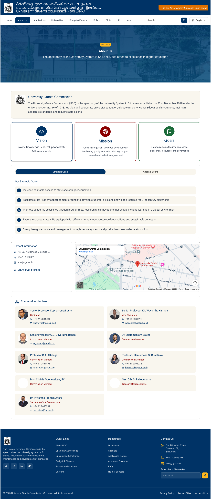

### Admission
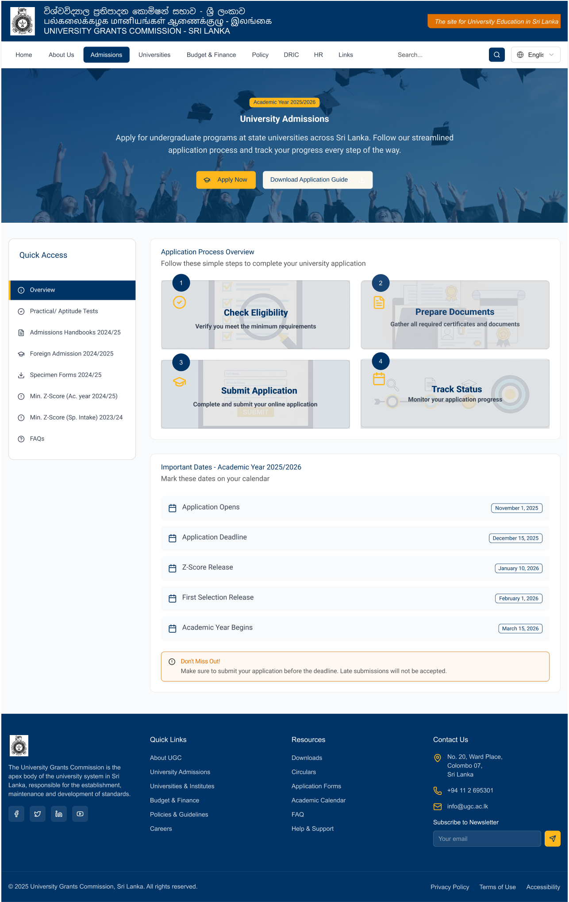

### Budjet & Finance
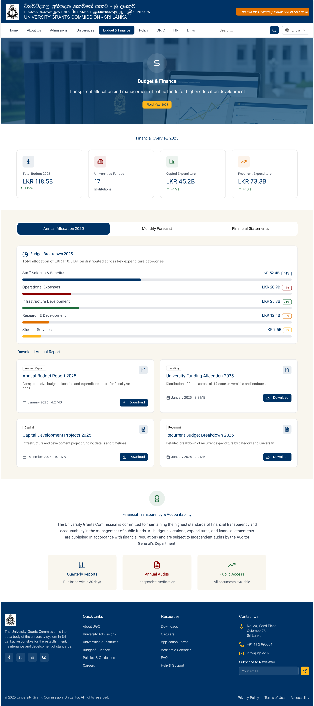

### Career Opportunities
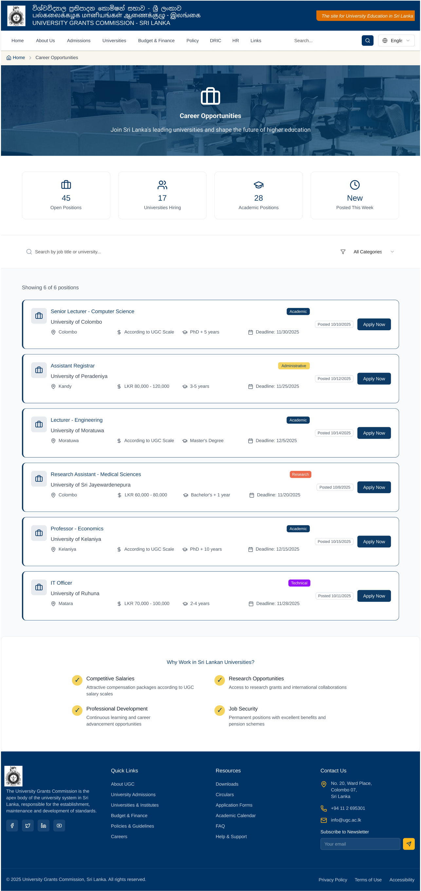

### DRIC
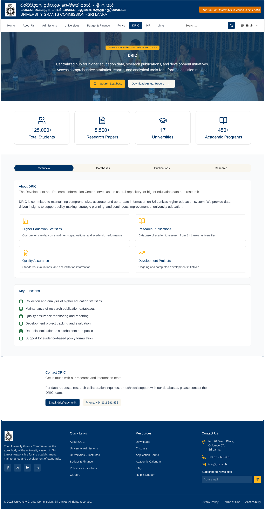

### HR
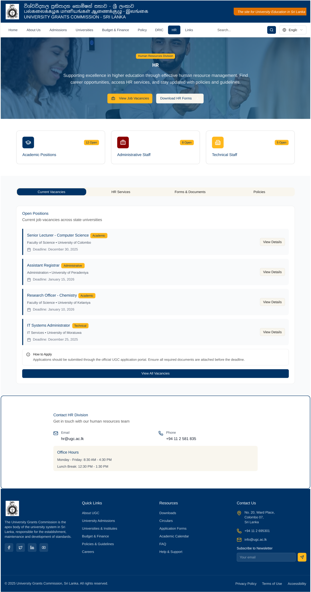

### Policy
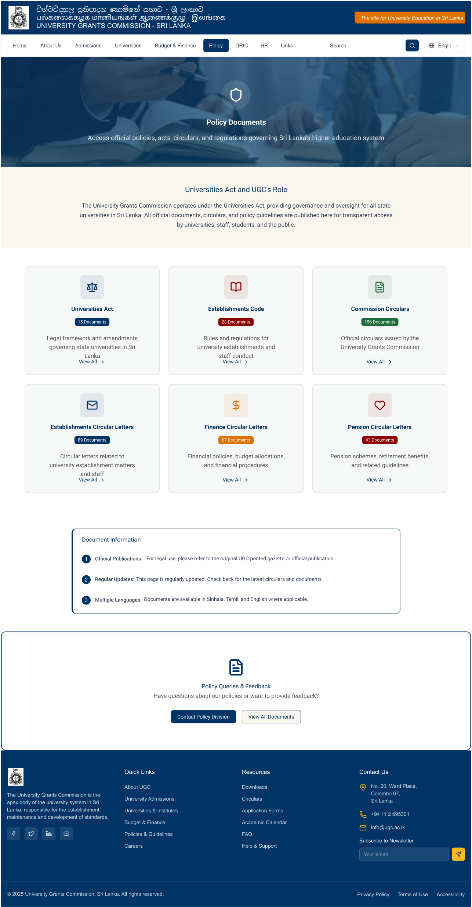

### Procurement
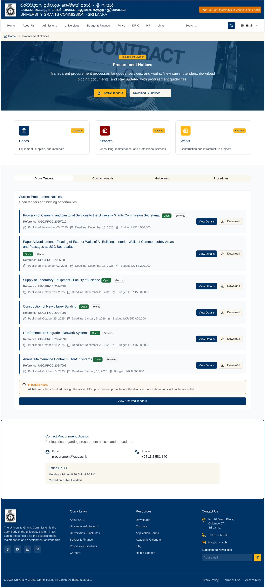

### Publications
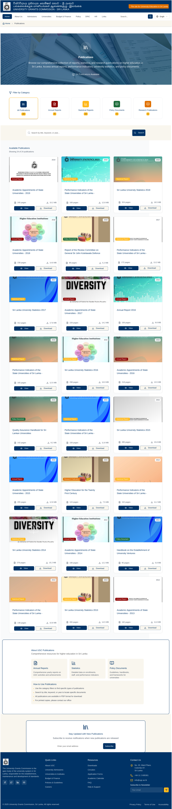

### Scholarships
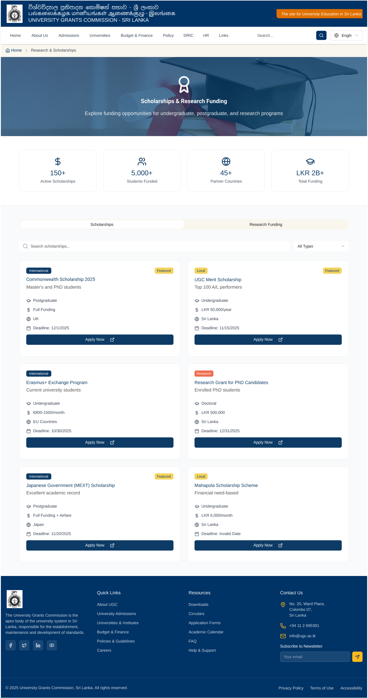

### Special Notices
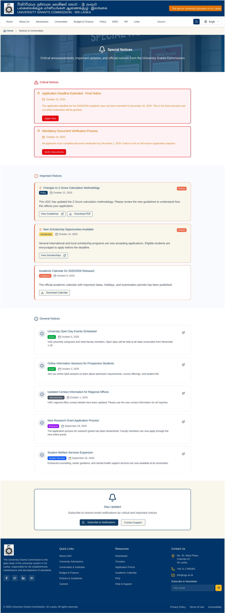

### Statistics
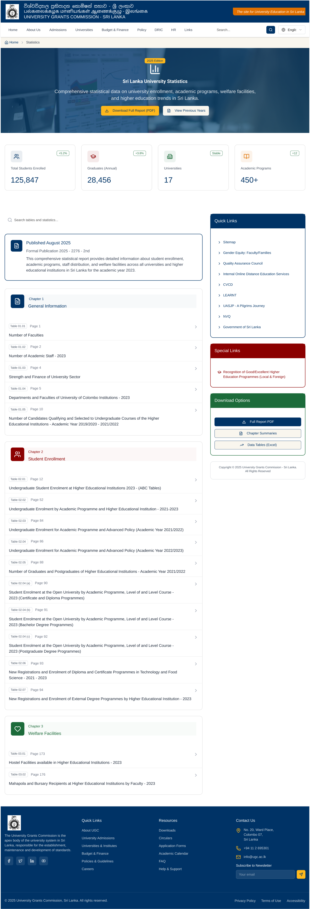

### Universities & Institutes
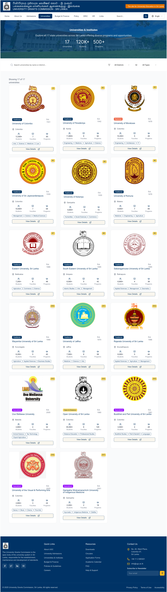

### Useful Links

